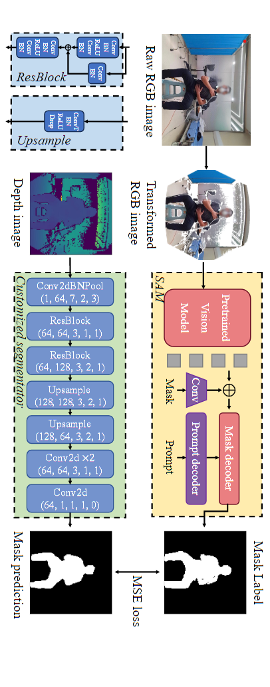

# DeepBreath Reproduction

This repository contains a reproduction of the **"DeepBreath"**. It can be used for breathing mode classification and tidal volume estimation.

---

## Paper Reference

- [DeepBreath: Breathing Exercise Assessment with a Depth Camera](https://dl.acm.org/doi/10.1145/3678519)

## Dataset

- [Soleimani's Dataset](https://data.bris.ac.uk/data/dataset/1tqzx39mzkw832msuvy3obktqi) There are samples in `data/01/` directories.

---

## Preparation

Move `deepbreath_10S.pkl`, `model_para_loso_xiewt.pkl` and `segmentator.pkl` to root directory.

## Project Overview

### Segmentator Architecture

1. **Input**: Original depth image resized to `128 × 128`.
2. **Model Layers**:
    - `conv2d bn pool(1,64,7,2,3)`
    - `resblock(64,64,3,1,1)`
    - `resblock(64,128,3,2,1)`
    - `upsample(128,128,3,2,1)`
    - `upsample(128,64,3,2,1)`
    - `conv2d x2(64,64,3,1,1)`
    - `conv2d x1(64,1,1,1,0)`

#### ResBlock Details:
- `conv, bn, relu, conv, bn`
- Add residual connection: `+`
- `conv, bn`
- Output: `conv, bn, relu, conv, bn`

#### Upsample Details:
- `convt, bn, relu, drop`

---

## Known Issues

1. **Output Size**: The expected output size is `128 × 128`, but the current implementation produces `64 × 64`.
2. **Kernel Size Mismatch**: The upsample block's kernel size in the checkpoint is `2`, while the paper specifies `3`.
3. **Performance**: The model does not perform well on my data.
